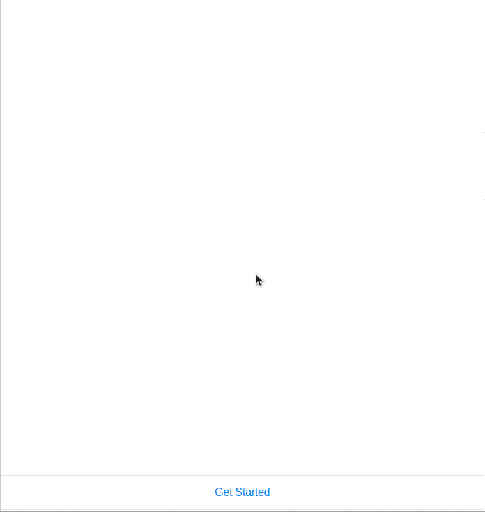
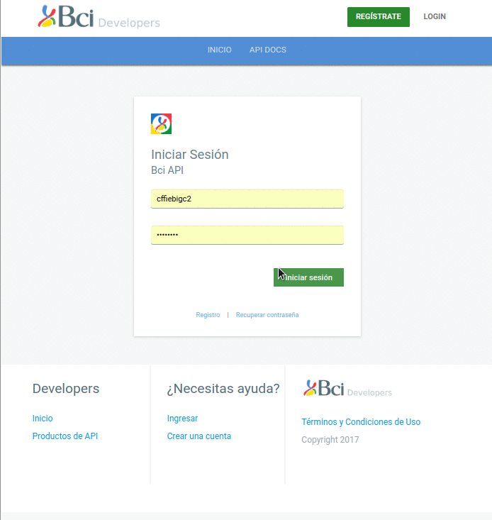
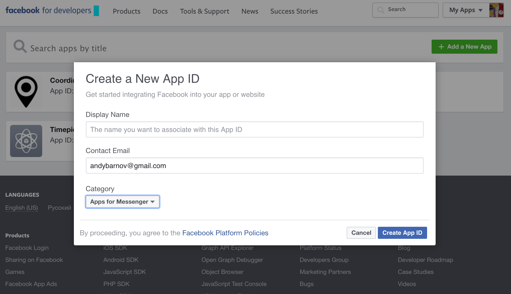

# Chatbot Developers BCI
### All you need to launch your own functional Ruby bot for Facebook Messenger integrated with BCI APIs.

[Read more about this bot on Speaker Deck](https://speakerdeck.com/cffiebigc/messenger-chat-bot)

[Talk to Demo Bot](http://m.me/chatbotbcidevelopers)

## Bot actions integrated with APIs from BCI:

### - `Indicadores`: Get the financial indicators on demand


### - `Descuentos cercanos`: Request the user location and display the 3 nearest discounts



### Create your own bot integrated with BCI, It's as easy as:

1. Clone the boilerplate.
2. Customize message bindings and commands for your bot.
3. Push your bot to Heroku and review it with Facebook.
4. You're live! :speech_balloon:

This chatbot is based on **Rubotnik**, a minimalistic boilerplate and *a microframework proof-of-concept* that allows you to launch your functional bot on a Messenger Platform in a matter of minutes. It is a companion to ingenious [facebook-messenger](https://github.com/hyperoslo/facebook-messenger) gem and piggybacks on its `Bot.on :event` triggers. The main promise of **Rubotnik** is to speed up bot development in Ruby and provide a more natural mental model for bot-user interactions. To learn more about bot interactions please read [Rubotnik's Documentation](https://github.com/progapandist/rubotnik-boilerplate)

# Setup

### Register and create your app in the [developers portal](https://developers.bci.cl/) to get your `API_KEY`



### Follow [this instructions](https://developers.google.com/maps/documentation/directions/get-api-key) to get your `Google Maps API KEY`

Create a file named `.env` on the root level of the boilerplate. Create another file called `.gitignore` and add this single line of code:

```
.env
```
Save the `.gitignore` file. Now open your `.env` and put two tokens (one you've just generated and another you need to come up with and save for later) inside:

```ruby
BCI_API_KEY=your_recently_created_bci_api_key
GOOGLE_API_KEY=your_google_maps_api_key

```

From now on, they can be referenced inside your program as `ENV['BCI_API_KEY']` and `ENV['GOOGLE_API_KEY']`.


## Facebook setup pt. 1. Tokens and environment variables.

Login to [Facebook For Developers](https://developers.facebook.com/). In the top right corner, click on your avatar and select **"Add a new app"**



In the resulting dashboard, under PRODUCTS/Messenger/Settings, scroll to **"Token Generation"** and either select an existing page for your bot (if you happen to have one) or create a new one.


Copy **Page Access Token** and keep it at hand. Don't close this window.

Now open your `.env` and put two tokens (one you've just generated and another you need to come up with and save for later) inside:

```ruby
ACCESS_TOKEN=your_page_access_token_from_the_dashboard
VERIFY_TOKEN=come_up_with_any_string_you_will_use_at_next_step

```

They can be referenced inside your program as `ENV['ACCESS_TOKEN']` and `ENV['VERIFY_TOKEN']`.

**Note:**
*Rubotnik stores its environment variables (aka config vars) locally in .env file (here goes the standard reminder to never check this file into remote repository) `heroku local` loads its contents automatically, so you don't need to worry about setting them manually. If you don't want to use `heroku local` and prefer an old good `rackup`, make sure to uncomment `require 'dotenv/load'` on top of `bot.rb` so variables will be loaded in your local environment by [dotenv](https://github.com/bkeepers/dotenv) gem. If you do so, don't forget to comment it out again before pushing to Heroku for production. In production, you will have to set your config variables by hand, either in your dashboard, or by using `heroku config:set VARIABLE_NAME=value` command in the terminal.*

## Running on localhost

Make sure you have [Heroku CLI](https://devcenter.heroku.com/articles/heroku-cli) and [bundle](http://bundler.io/). If you haven't done it before run `bundle install` to install all the required gems and once it finished run `heroku local` to start bot server on localhost.

Provided you set up your token correctly, you should see something like this:


By default, bot will run on port 5000. Start [ngrok](https://ngrok.com/) on the same port:

```
ngrok http 5000
```
This will expose your localhost for external connections through an URL like `https://92832de0.ngrok.io` (the name will change every time you restart ngrok, so better keep it running in a separate terminal tab). Make note of the URL that start with `https://`, you will give to Facebook in the next step.


## Facebook setup pt. 2. Webhooks.

Now that your bot is running on your machine, we need to connect it to the Messenger Platform. Go back to your dashboard. Right under **Token Generation** find **Webhooks** and click "Setup Webhooks". In the URL field put your HTTPS ngrok address ending with `/webhook`, provide the verify token you came up with earlier and under Subscription Fields tick *messages* and *messaging_postbacks*. Click **"Verify and Save"**.


> :tada: Congrats! Your bot is connected to Facebook! You can start working on it.

# Deployment

Once you have designed your bot and tested in on localhost, it's time to send it to the cloud, so it live its life without being tethered to your machine. Assuming you already have a Heroku account and Heroku CLI tools installed, here's pretty much the whole process:

```bash
heroku create YOUR_APP_NAME
heroku config:set ACCESS_TOKEN=your_own_page_token
heroku config:set VERIFY_TOKEN=your_own_verify_token
heroku config:set BCI_API_KEY=your_own_bci_api_key
heroku config:set GOOGLE_API_KEY=your_own_google_api_key
git push heroku master
```

Now don't forget to go back to your Facebook developer console and change the address of your webhook from your ngrok URL to Heroku one. That's it!

### :tada: You're live! :tada:
